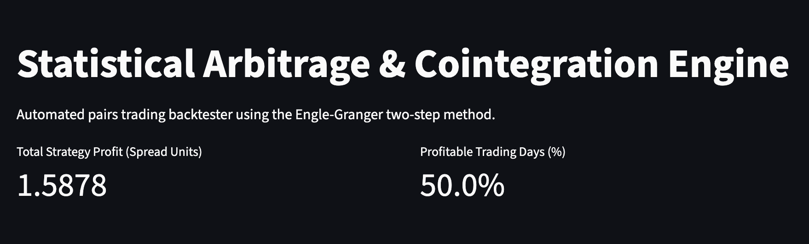
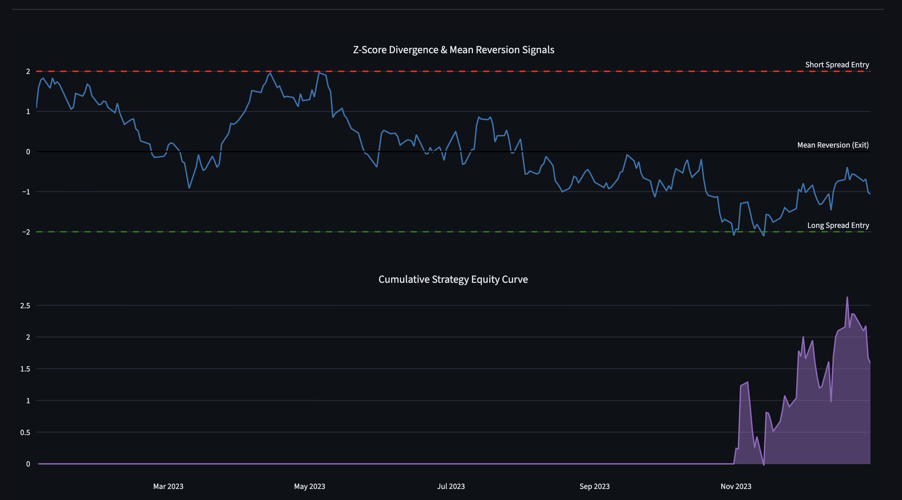

# Statistical Arbitrage & Cointegration Engine

An automated quantitative trading backtester designed to systematically identify and exploit mean-reverting asset pairs using the Engle-Granger two-step method. This engine ingests historical price matrices, calculates dynamic hedge ratios, tests for statistical stationarity, and simulates trade execution based on Z-Score divergences.

## Business Use Case & Assumptions

In quantitative finance, statistical arbitrage strategies rely on the mathematical relationship between co-moving assets rather than fundamental direction. This engine automates the complex statistical tests required to validate these relationships and provides a robust framework for backtesting strategy performance.

**Core Assumptions:**
* **Stationarity:** The strategy assumes that the spread between the two assets is mean-reverting, verified mathematically via the Engle-Granger cointegration test (p-value < 0.05).
* **Execution Variables:** Assumes trades are executed at the adjusted close price on the day following the statistical signal. For this baseline model, transaction fees and execution slippage are excluded to isolate the pure mathematical edge of the cointegrated pair.

The engine specifically solves the following quantitative challenges:
* **Stationarity Validation:** Implements the Engle-Granger cointegration test to mathematically confirm if a spread is mean-reverting.
* **Dynamic Hedge Ratios:** Utilizes Ordinary Least Squares (OLS) regression to dynamically calculate the optimal hedge ratio between two assets.
* **Automated Execution Logic:** Simulates a long/short trading strategy by executing positions when the normalized Z-Score diverges past statistical boundaries (Z > 2.0 or Z < -2.0) and exiting upon mean reversion (Z = 0.0).

## Key Features & Visualizations

The analytical dashboard, built with Streamlit and Plotly, allows users to visually inspect the statistical signals and the resulting equity curve.

* **Z-Score Divergence:** A dual-axis chart mapping the normalized spread against statistical entry and exit thresholds. It clearly visualizes when the spread is overextended and ripe for mean reversion.
* **Cumulative Strategy Equity Curve:** A visual representation of the strategy's compounding returns over the backtested period, allowing for rapid assessment of historical profitability.

## Tech Stack

* **Data Engineering:** yfinance, Pandas, NumPy
* **Quantitative Analytics:** Statsmodels (Engle-Granger, OLS)
* **Visualization & Frontend:** Plotly, Streamlit
* **Architecture:** Modular Python scripts for data ingestion, statistical testing, backtesting, and interactive visualization.

## Quickstart & Testing Guide

### 1. Live Interactive Demo (For Recruiters & Hiring Managers)
To immediately evaluate the statistical arbitrage model, visual signals, and dashboard functionality without setting up a local environment, please access the live application here:
**[Launch Stat-Arb Engine Dashboard](https://stat-arb-engine-fmq7qujmthwccasnqkbfbr.streamlit.app/)**

### 2. Local Technical Review (For Engineering Leads)
If you wish to review the underlying Python architecture and test the statistical cointegration engine locally, please follow these steps.

**Step 1: Clone the repository**
`git clone https://github.com/Ma2323/stat-arb-engine.git`
`cd stat-arb-engine`

**Step 2: Activate the environment and install dependencies**
`python3 -m venv venv`
`source venv/bin/activate`
`python3 -m pip install -r requirements.txt`

**Step 3: Execute the mathematical logic pipeline**
The following commands will download the historical pricing matrix, run the Engle-Granger test, generate the hedge ratio, and execute the backtest.
`python3 data_fetcher.py`
`python3 cointegration_logic.py`
`python3 backtester.py`

**Step 4: Launch the analytics interface**
`python3 -m pip install streamlit plotly`
`streamlit run app.py`